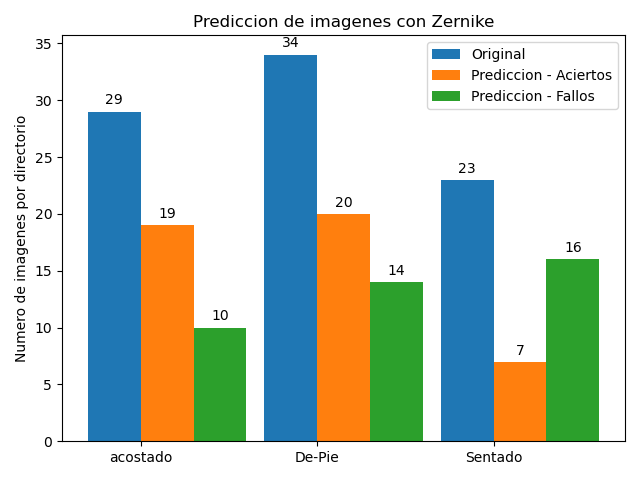

# Computer Vision para la identifiacion Momentos Zernike

1. Desarrollar un programa que permita calcular el Histograma de Gradientes Orientados (HOG) de
zonas de interés en una imagen a fin de detectar peatones, para ello deberá considerar los siguientes
aspectos

- Calculo los momentos de Zernike de todas las imágenes contenidas en el archivo “CorpusSiluetas.zip”

```sh
  pip install mahotas
  import mahotas
  def obtencionMomentosZernike(image):
    # Calculamos los momentos de zernike con mahotas paso de un canal en especifico en este  #
    # caso seria el canal rojo y pasamos el tamano de la imagen que son de 512 #
    return mahotas.features.zernike_moments(image[:, :, 0], 512)
```
- Medir la distancia Euclídea 

```sh
  def calculoDistanciaEuclidea(momentosImgOriginal, momentosImgAComparar):
    # definicion de variable para almacenar resultado de la resta de los valores de cada momento #
    resta = 0.0
    # Recorrido de los momentos de nuestras imagenes #
    for i in range(len(momentosImgOriginal)):
        resta=resta+pow(momentosImgOriginal[i]- momentosImgAComparar[i],2);
    # Retorno de la distancia obtenida entre las imagenes #
    return sqrt(resta);
```
- Determinar qué posturas estan clasificas correcta o incorrectamente
```sh
  def presicionDelModelo(original, prediccion):
    # Funcion para contar la cantidad de aciertos y fallos del clasificador #
    cont_aciertos = 0; 
    cont_fallos = 0;
    # Recorrido de valores originales #
    for i in range(len(original)):
        if (original[i] == prediccion[i]):
            cont_aciertos = cont_aciertos+1
        else:
            cont_fallos = cont_fallos + 1
    
    return cont_aciertos, cont_fallos
```
- Generación de gráfica para indicar la presición del descriptor de Zernike 

- Generacion de medidas de calidad y matriz de confusión
```sh
  def medidasDeCalidad(prediccion, salida):
    print (confusion_matrix(prediccion, salida)) 
    accuracy = accuracy_score(prediccion, salida)
    f1 = f1_score(prediccion, salida, average='weighted')
    recall = recall_score(prediccion, salida, average='weighted')
    precision = precision_score(prediccion, salida, average='weighted')
    print (classification_report(prediccion, salida))
```
## Resultados
### Matriz de Confusion
```sh
[[19  5  5]
 [ 9 20 11]
 [ 1  9  7]]
```
### Medidas de Calidad
 - Accuracy: 0.5348837209302325
 - F1 score: 0.5415304839723444
 - Recall: 0.5348837209302325
 - Precision: 0.5546898233509785
### Reporte de Clasificación
```sh
              precision    recall  f1-score   support

           0       0.66      0.66      0.66        29
           1       0.59      0.50      0.54        40
           2       0.30      0.41      0.35        17

    accuracy                           0.53        86
   macro avg       0.52      0.52      0.52        86
weighted avg       0.55      0.53      0.54        86
```
