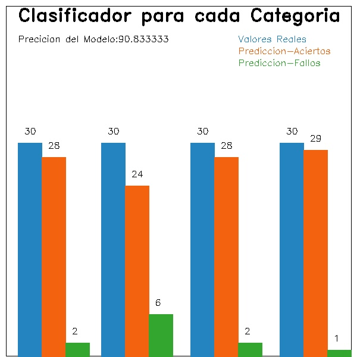

# Computer Vision para la identifiacion de Momentos Zernike

## 3. Desarrollar un programa que permita clasificar una región de interés de una imagen, dada su textura

- Programar un método que permita convertir una imagen de un espacio de color en el espacio CIELab

```sh
  //lECUTA de imagen a ser comparada, imagen original del test
  img = imread(PATHS_Test[i]+pathImagenDirectorioActualString);
  //resize(img, img, cv::Size(), 0.75, 0.75);
  //Pasamos la imagen al espacio de color CIELAB
  cvtColor(img, img, COLOR_RGB2Lab);
```
- Método programado que dada una imagen o región de interés permita calcular el descriptor LBP

#### Referencia: 
- L. Serpa-Andrade, V. Robles-Bykbaev, E. Calle-Ortiz, L. González-Delgado and G. Guevara-Segarra, "A proposal based on color descriptors and local binary patterns histogram as support tool in presumptive diagnosis of hiatus hernia," 2014 IEEE International Autumn Meeting on Power, Electronics and Computing (ROPEC), 2014, pp. 1-5, doi: 10.1109/ROPEC.2014.7036342.
- 
```sh
   int* LBPDescriptor::LBP8(const int* data, int rows, int columns){
      const int
      *p0 = data,
      *p1 = p0 + 1,
      *p2 = p1 + 1,
      *p3 = p2 + columns,
      *p4 = p3 + columns,
      *p5 = p4 - 1,
      *p6 = p5 - 1,
      *p7 = p6 - columns,
      *center = p7 + 1;
      int r,c,cntr;
      unsigned int value;
      int* result = (int*) malloc(256*sizeof(int));
      memset(result, 0, 256*sizeof(int));
      for (r=0;r<rows-2;r++){
          for (c=0;c<columns-2;c++){
              value = 0;
              cntr = *center - 1;
              compab_mask_inc(p0,0);
              compab_mask_inc(p1,1);
              compab_mask_inc(p2,2);
              compab_mask_inc(p3,3);
              compab_mask_inc(p4,4);
              compab_mask_inc(p5,5);
              compab_mask_inc(p6,6);
              compab_mask_inc(p7,7);
              center++;
              result[value]++;
          }
          p0 += 2;
          p1 += 2;
          p2 += 2;
          p3 += 2;
          p4 += 2;
          p5 += 2;
          p6 += 2;
          p7 += 2;
          center += 2;
      }

      return result;
   }
   
```
- Deberá calcular el descriptor LBP para al menos 2 imágenes distintas: clase 1 y clase 2.
Para esta parte se tiene un dataset con 4 clases: link del dataset https://www.robots.ox.ac.uk/~vgg/data/dtd/index.html
Los cuales son: 
1. banded
2. chequered
3.  cracked
4. crystalline
5. test_Imagenes

- Dado un nuevo grupo de imágenes deberá calcular la precisión de su clasificador basado en el descriptor LBP para identificar a qué clase pertenece la imagen (clase 1 o clase 2)

```sh
  //Funcion que nos permite calcular la distancia euclidea entre dos imagenes
  double distanciaEuclidea(vector<int> *lbpOriginal, vector<int> *lbpCompare){

    double distancia, resta = 0;

    for (int i=0;i<256;i++){    //Bucle para restar componentes y elevarlas a 2
        resta=resta+pow(lbpOriginal->at(i)- lbpCompare->at(i),2);
    }
    return distancia=sqrt(resta);
    return 0.0;
  }
  
  list <Categoria> :: iterator it;
  for(it = listaClasificacionCategoriaResultados.begin(); it != listaClasificacionCategoriaResultados.end(); ++it){
      //cout  << '\t' <<it->getDistancia() << ":"<< it->getCategoria()<< " : "<<it->getIdentificador()<< " : "<<it->getClasificador()<<'\t';   
      if(it->getClasificador() == 0){
          if(it->getClasificador() == it->getCategoria()){
              contadorAciertos0++;
          }else {
              contadorFallos0++;
          }
      }else if(it->getClasificador() == 1){
          if(it->getClasificador() == it->getCategoria()){
              contadorAciertos1++;
          }else {
              contadorFallos1++;
          }
      }else if(it->getClasificador() == 2){
          if(it->getClasificador() == it->getCategoria()){
              contadorAciertos2++;
          }else {
              contadorFallos2++;
          }
      }else if(it->getClasificador() == 3){
          if(it->getClasificador() == it->getCategoria()){
              contadorAciertos3++;
          }else {
              contadorFallos3++;
          }
      }

      if(it->getClasificador() == it->getCategoria()){
          contadoAciertosTotales++;
      }else {
          contadoFallosTotales++;
      }

  }
```

## Resultados
### PRESICION DEL CLASIFICADOR LBP
```sh
Size del descriptor LBP: 256
Clasificados correctamente: 109
Clasificados Incorrectamente: 11
```
### PRESICION DEL CLASIFICADOR LBP POR CATEGORIAS
#### PRESICION DEL PARA LA CATEGORIA BANDED
- Clasificados correctamente: 28
- Clasificados Incorrectamente: 2
- Precision del modelo: 93.333333
#### PRESICION DEL PARA LA CATEGORIA CHEQUERED
- Clasificados correctamente: 24 
- Clasificados Incorrectamente: 6
- Precision del modelo: 80.000000
#### PRESICION DEL PARA LA CATEGORIA CRACKED
- Clasificados correctamente: 28
- Clasificados Incorrectamente: 2
- Precision del modelo: 93.333333
#### PRESICION DEL PARA LA CATEGORIA CRYSTALLINE 
- Clasificados correctamente: 29
- Clasificados Incorrectamente: 1
- Precision del modelo: 96.666667
### Generación de gráfica para indicar la presición de LBP 

